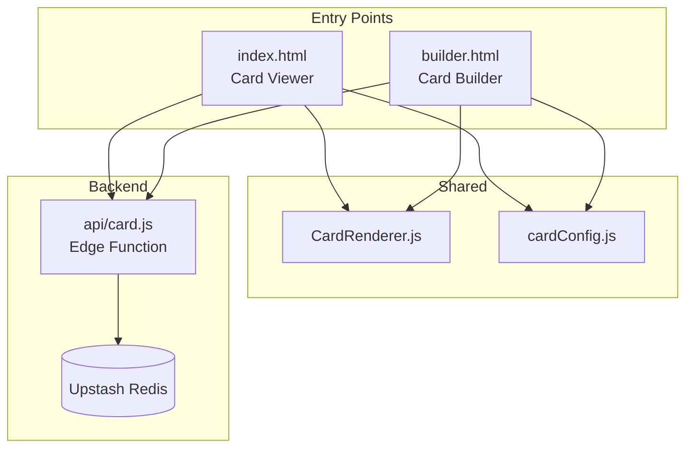
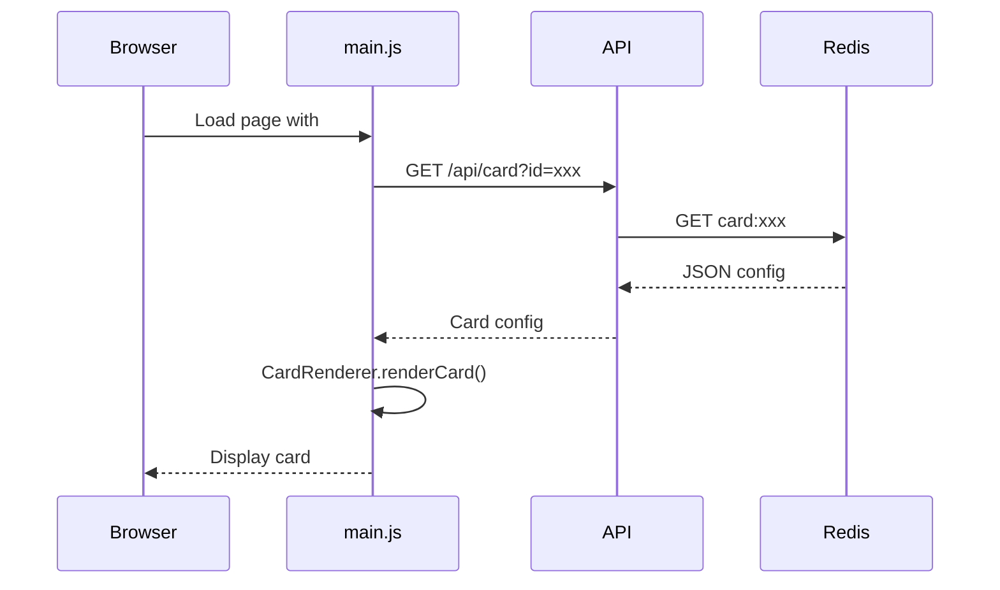
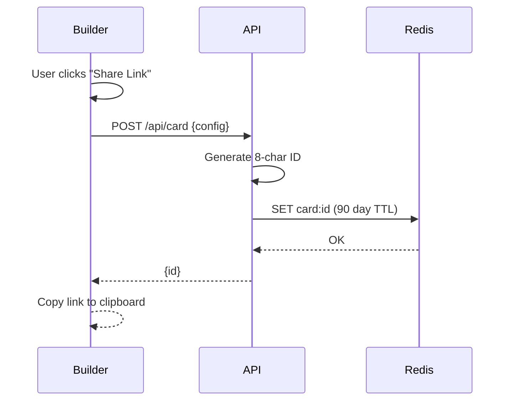
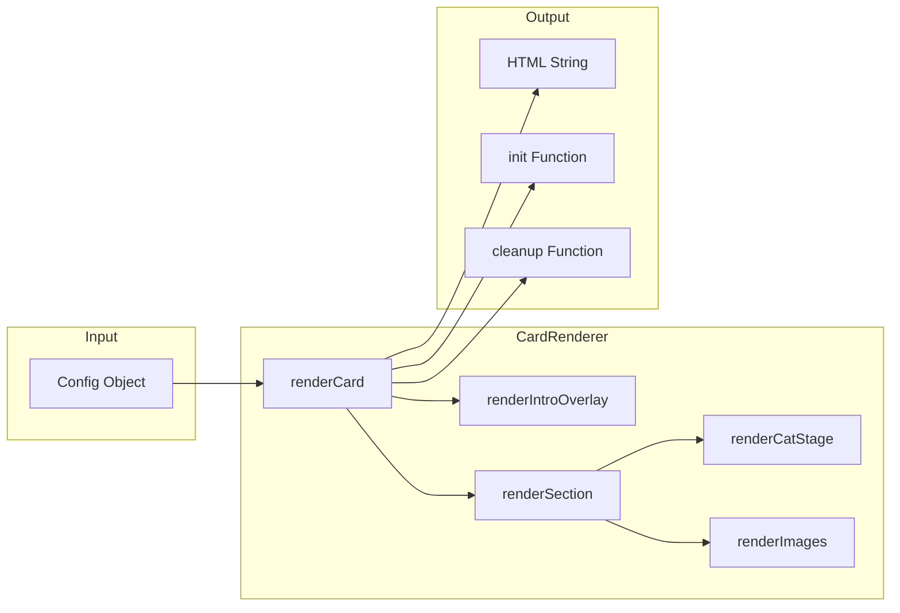
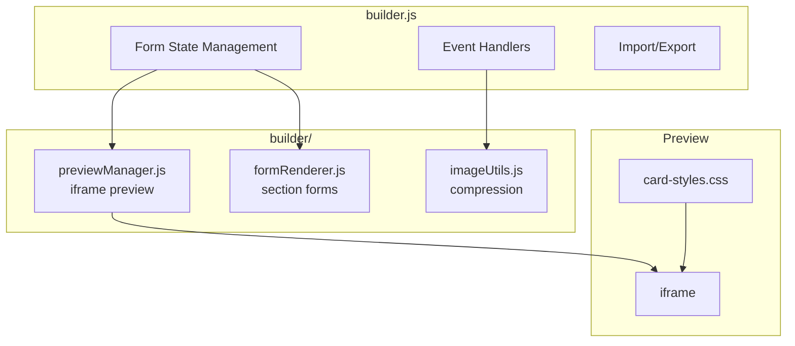
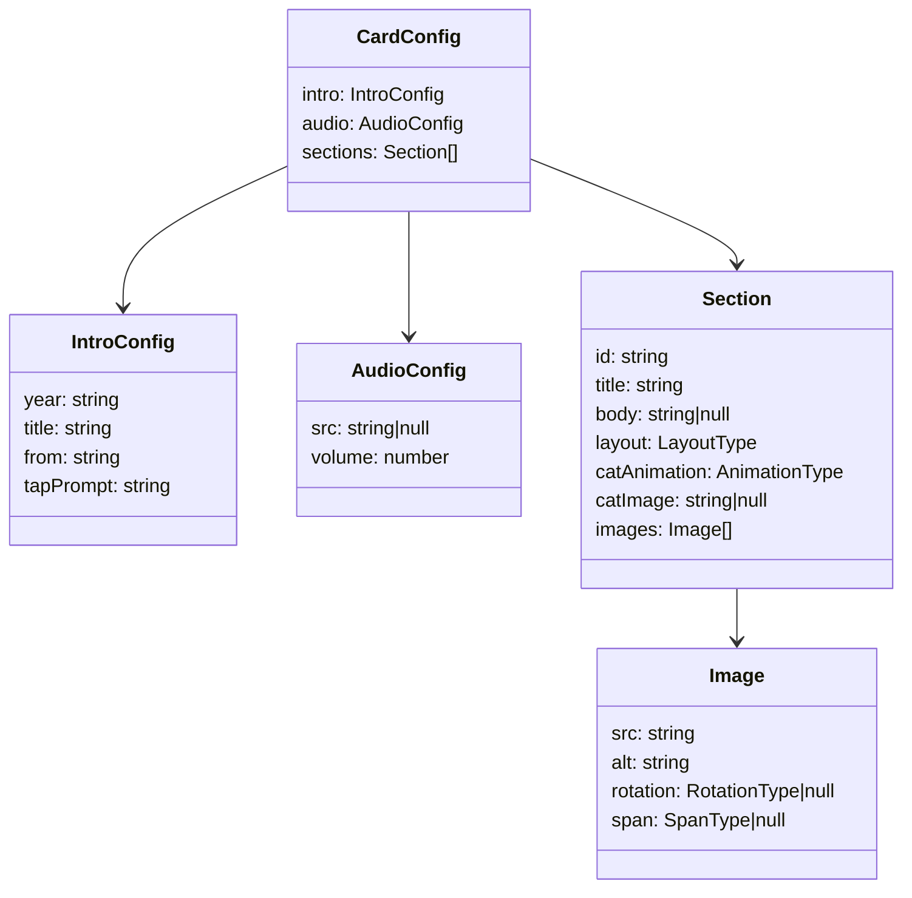
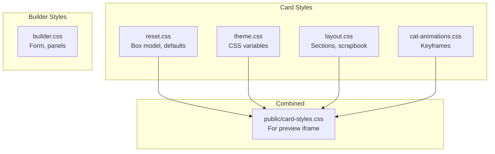
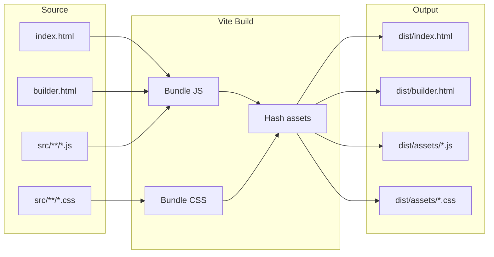
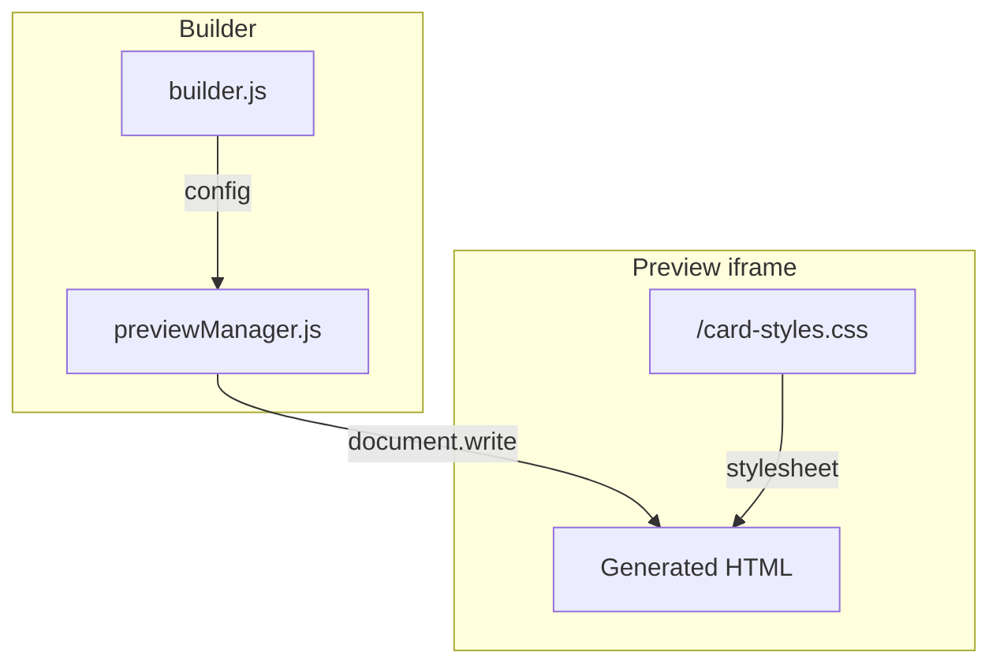
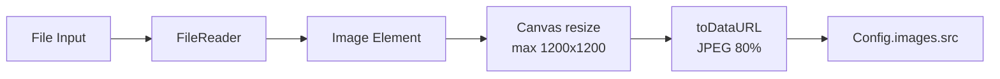

# Architecture

This document describes the technical architecture of the Holiday Card 2025 application.

## Overview

The application consists of two main entry points:
1. **Card Viewer** (`index.html`) - Renders and displays holiday cards
2. **Card Builder** (`builder.html`) - Visual editor for creating cards

Both share a common `CardRenderer` component and configuration schema.



## Data Flow

### Card Viewing



### Card Sharing



## Component Architecture

### CardRenderer

The core rendering component that converts config objects into HTML:



**Return value:**
- `html` - Complete card HTML string
- `init(container)` - Sets up audio, observers, and event handlers
- `cleanup()` - Stops audio, disconnects observers

### Builder Architecture



## Configuration Schema



**Layout Types:** `tall-left`, `tall-right`, `hero-top`, `hero-bottom`, `trio`, `single`

**Animation Types:** `walk-across`, `peek-corner`, `sleep-corner`, `pop-up`, `both-cats`, `none`

**Rotation Types:** `cw-1`, `cw-2`, `ccw-1`, `ccw-2`, `null`

**Span Types:** `tall`, `hero`, `null`

## CSS Architecture

Styles are organized into focused modules:



### CSS Custom Properties

Theme variables are defined in `theme.css`:

```css
:root {
  /* Colors */
  --color-background: #FAF7F2;
  --color-text: #2C2C2C;
  --color-accent-primary: #4A6741;

  /* Typography */
  --font-family-base: 'Georgia', serif;
  --font-size-title: clamp(2rem, 5vw, 3.5rem);

  /* Animation */
  --timing-cat-easing: cubic-bezier(0.34, 1.56, 0.64, 1);

  /* Layout */
  --section-max-width: 600px;
  --cat-size-medium: 120px;
}
```

## API

### Endpoints

| Method | Path | Description |
|--------|------|-------------|
| `GET` | `/api/card?id=xxx` | Load card config by ID |
| `POST` | `/api/card` | Save card config, returns `{id}` |

### Storage

- **Backend:** Upstash Redis (REST API)
- **Key format:** `card:{id}`
- **TTL:** 90 days
- **Max size:** ~10MB (Upstash limit)

### Edge Runtime

The API runs on Vercel Edge Functions for low latency:

```javascript
export const config = {
  runtime: 'edge',
};
```

## Build Pipeline



**Multi-entry config:**

```javascript
// vite.config.js
export default defineConfig({
  build: {
    rollupOptions: {
      input: {
        main: 'index.html',
        builder: 'builder.html'
      }
    }
  }
})
```

## Preview Iframe

The builder's live preview uses an iframe that renders the card in isolation:



**Key insight:** The iframe loads `/card-styles.css` from the public folder, which contains all card styles combined. This works in both dev (Vite serves `/public`) and production (copied to `/dist`).

## Scroll Behavior

Cards use CSS scroll-snap for section navigation:

```css
html {
  scroll-snap-type: y mandatory;
}

.card-section {
  height: 100dvh;
  scroll-snap-align: start;
  scroll-snap-stop: always;
}
```

Cat animations trigger via `IntersectionObserver`:

```javascript
const observer = new IntersectionObserver((entries) => {
  entries.forEach(entry => {
    if (entry.isIntersecting) {
      section.querySelector('[data-cat-trigger]')
        .classList.add('is-visible');
    }
  });
}, { threshold: 0.5 });
```

## Image Handling

Images are compressed client-side before embedding:



This reduces payload size when saving cards to Redis.
